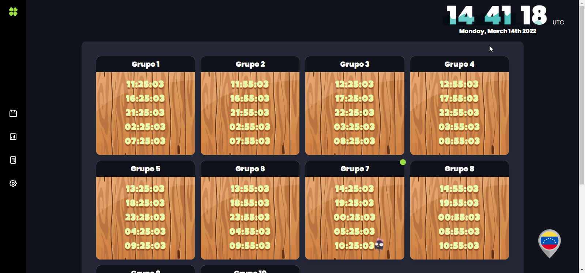
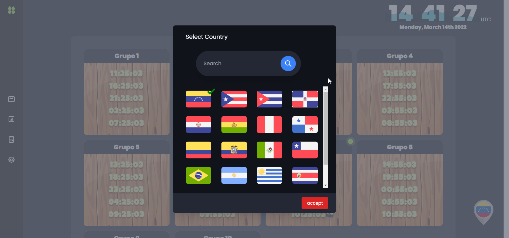
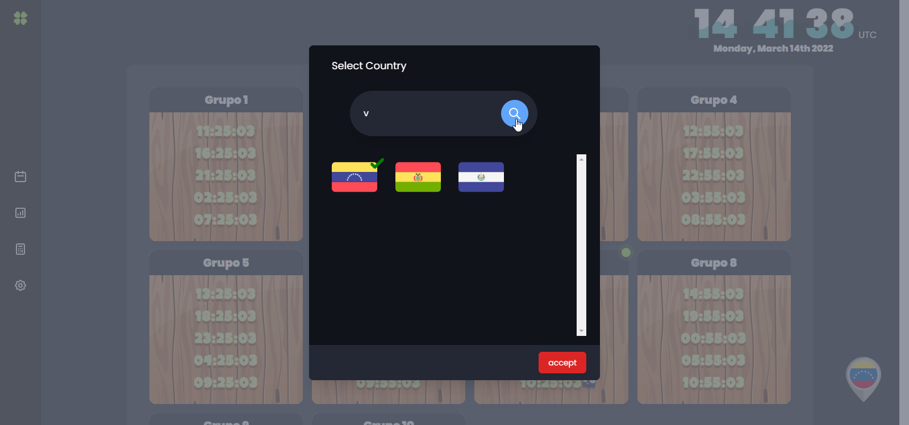
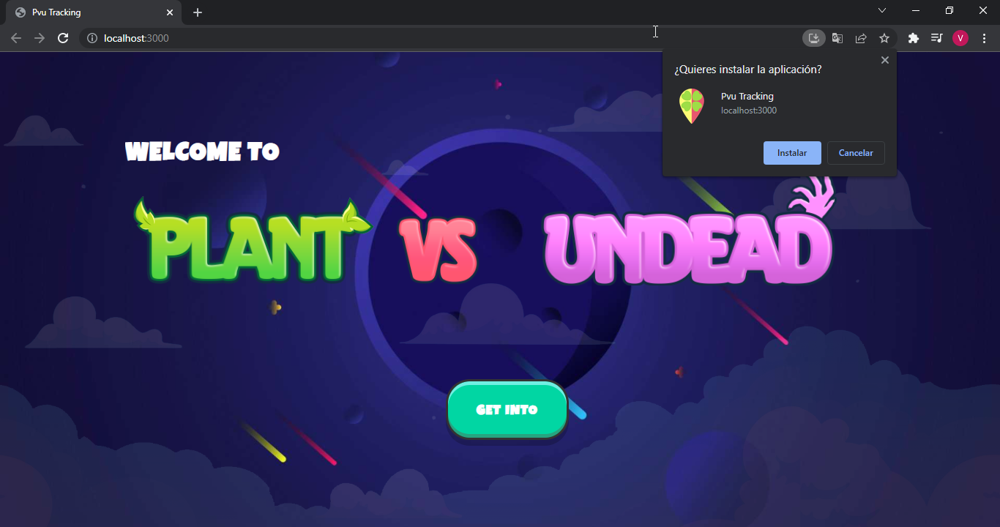
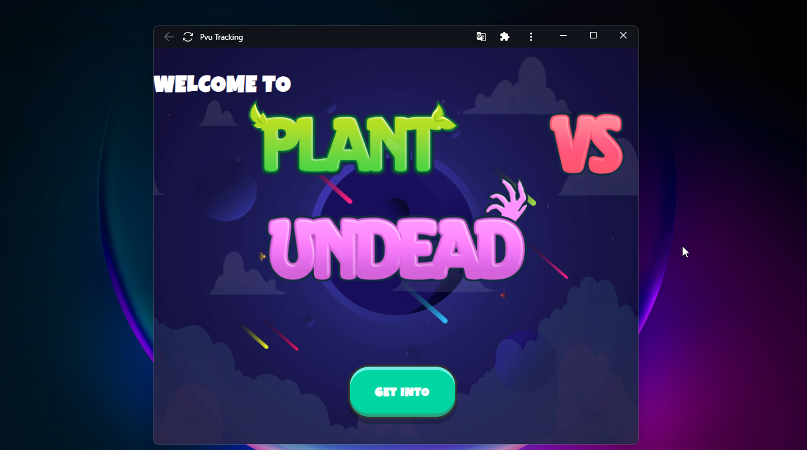

# PlantsTracker

### Scheduling tool created during the early days of the game NFT Plants vs Undead, to manage the entry times to the game, because the entry to the game was divided by groups of people at different times, all to try to solve the high demand that the game had at that time. PlantsTracker was born because users did not know their entry times, since the game only announced which group the user belonged to.

### **The tool was developed as a PWA (progressive web application) which allows it to be installed on mobile and desktop devices.**

## **Development technologies**

- ReactJs
- TailWind

## **Installation**

1. Clone repository

```bash
git clone https://github.com/sourclab/plantstracker.git
```

2. Updating libraries

```bash
npm install
```

3. Generate key for geolocation service (**PlantsTracker uses a geolocation library, so users will be able to visualize the schedules according to the country where they are located.**)
   1. You will need to go to https://extreme-ip-lookup.com/ to register and get your key.
   2. In the repository you can find an .env.example file, create an .env file with this structure and paste its key.
4. Install a library called serve globally

```bash
npm install -g serve
```

5. Start the application

```bash
npm run start
```

---

## Screenshots







